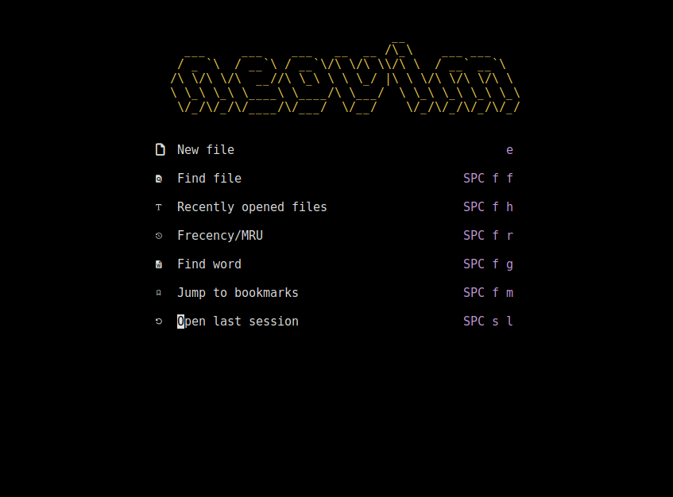
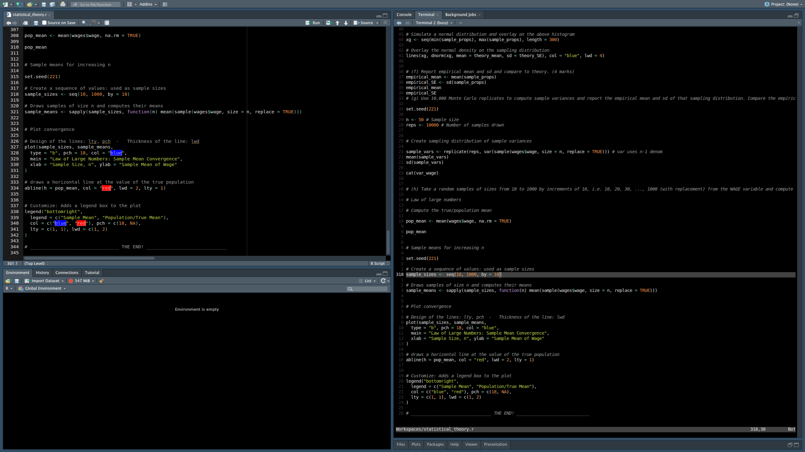
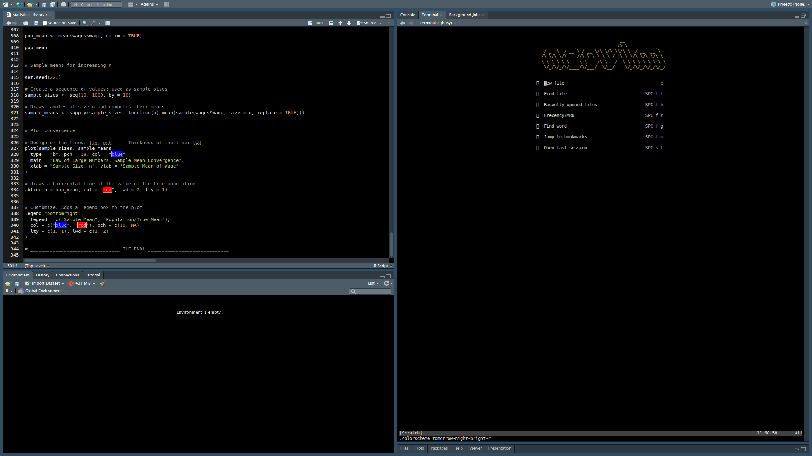

# Tomorrow Night Bright (RStudio Classic) for Neovim

A Neovim port of the "Tomorrow Night Bright (R Classic)" theme, designed to
recreate the classic feel of RStudio.

This theme is a port of the 
[VS Code/Positron version](https://github.com/gvelasq/tomorrow-night-bright-r-classic/)
, which itself is based on the classic Tomorrow Night Bright palette but with
specific RStudio-inspired syntax highlighting (e.g., functions and variables
use the foreground color for a cleaner, focused look)

# Installation

Using [lazy.nvim](https://github.com/folke/lazy.nvim):

```lua
{
  "your-username/tomorrow-night-bright-r.nvim",
  lazy = false,
  priority = 1000,
  config = function()
    vim.cmd([[colorscheme tomorrow-night-bright-r]])
  end,
}
```
## Screenshots

  

## Credits

- Ported to Neovim by **Kyle Hopkins**.
- Ported from [gvelasq/tomorrow-night-bright-r-classic](https://github.com/gvelasq/tomorrow-night-bright-r-classic/).
- Original palette from [Tomorrow Theme](https://github.com/chriskempson/tomorrow-theme) by **Chris Kempson**.

## License

MIT

